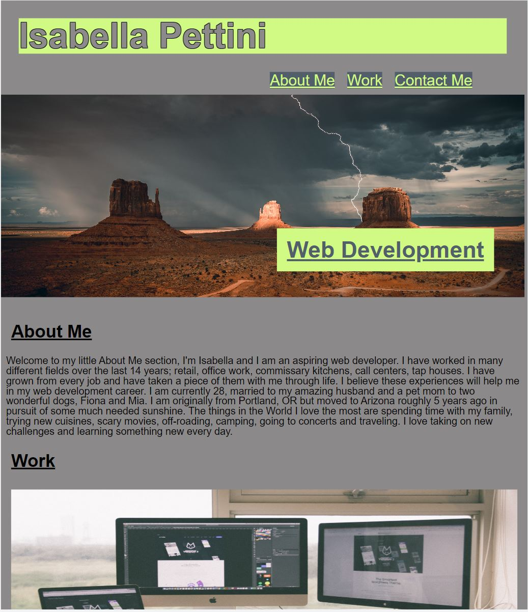

# Isabella Pettini's Portfolio

## Description

Creating a simple portfolio using advanced CSS, flexboxes and media queries. This portfolio showcases a couple of past projects, an 'About Me' section as well as links for how to get in contact. This portfolio can also be updated and modified as knowledge and project history grows.

## Installation

N/A

## Useage

This portfolio is broken down into three sections: About Me, Work, and Contact. The About Me has a brief description, work history, some hobbies and likes. The Work section has 2 past projects and a ‘Coming Soon’ placeholder to add more projects as they are completed. The contact section at this time, is not linked anywhere as professional pages have not been made at this time. This portfolio is a starting point for a future career in web development and a good place to document progress in the coming months.

 

## Link To Deployed Webpage:

[Isabella Pettini's Portfolio](https://isabella-pettini.github.io/isabella-pettini-portfolio/)

## Future Development:

Adding more projects, connecting a dedicated professional phone number and email address, adding JavaScript and making the page more dynamic. 

## Credits:

N/A

## License:
Please refer to the LICENSE in the repo.